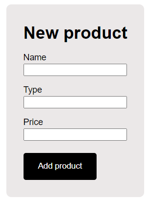
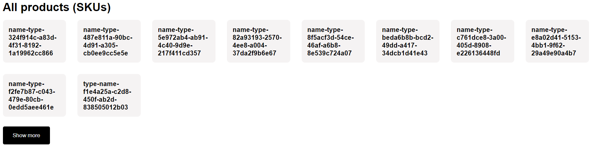
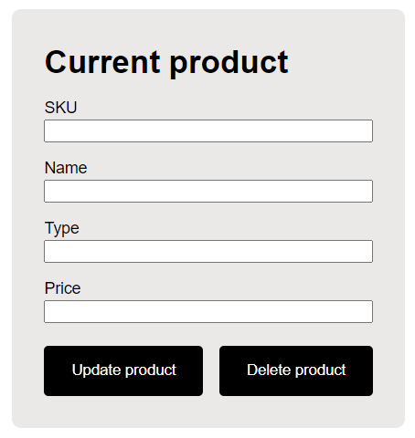

# xsolla-school-2021-backend


[Тестовое задание](https://github.com/xsolla/xsolla-school-backend-2021) для потока Backend Xsolla School 2021.  

Приложение позволяет управлять товарами с помощью методов RESTful API.  

Товар имеет:
* id (уникальный идентификатор UUID)
* SKU (идентификатор товарной позиции)
* название
* тип
* цену

Операции для управления товарами:
* Создание товара
* Редактирование товара по SKU (API позволяет использовать и SKU, и id)
* Удаление товара по SKU (API позволяет использовать и SKU, и id)
* Получение каталога товаров
* Получение информации о товаре по SKU (API позволяет использовать и SKU, и id)

Стек технологий:
* Node.js
* Express.js
* SQLite 3.x
* HTML, CSS, Pug

## Документация OpenAPI 3.0

Документация доступна по [ссылке](https://app.swaggerhub.com/apis/VladislavMaksimov/xsolla-school-2021-backend/1.0.0).

## Запуск приложения

1. Склонируйте репозиторий на свой компьютер
2. Установите необходимые пакеты командой  
```
npm install
```
3. Запустите приложение командой  
```
npm start
```
4. Откройте в браузере страницу http://localhost:3000/

## Тестирование приложения

Для тестирования приложения можно использовать графический интерфейс.

### Создание товара
<p align="center">
  
</p>

Для создания нового товара используйте форму **New product**. Введите название товара (Name), тип товара (Type) и цену (Price) и нажмите кнопку **Add product**. SKU товара генерируется на сервере автоматически по формуле: ``` %тип товара%-%название товара%-%уникальный идентификатор% ```. Чтобы товар появился в каталоге, после его создания перезагрузите страницу.
  
### Получение каталога товаров и информации о товаре
<p align="center">
  
</p>

Каталог товаров отображается в блоке **All products (SKUs)**. В нём выводятся карточки, содержащие SKU товаров. Нажмите на карточку с нужным товаром, чтобы в форме **Current product** отобразилась информация о нём.

### Редактирование и удаление товара
<p align="center">
  
</p>

Для изменения и удаления товара используйте форму **Current product**. Чтобы информация о товаре отобразилась в форме, нажмите на карточку товара в каталоге. Для изменения информации о товаре нажмите кнопку **Update product**: название товара будет заменено на значение поля Name, тип - на значение поля Type, цена - на значение поля Price. SKU товара изменится автоматически. Для удаления товара нажмите кнопку **Delete product**. После удаления или изменения продукта, перезагрузите страницу, чтобы увидеть изменения в каталоге товаров.
